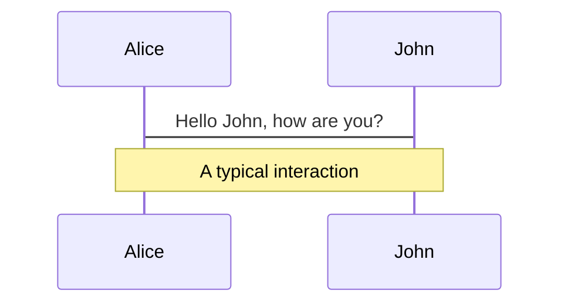
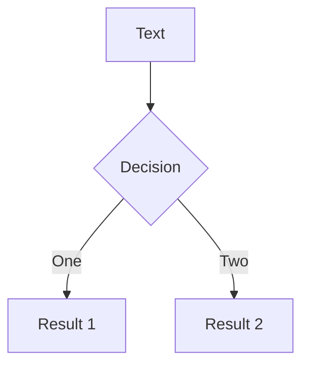
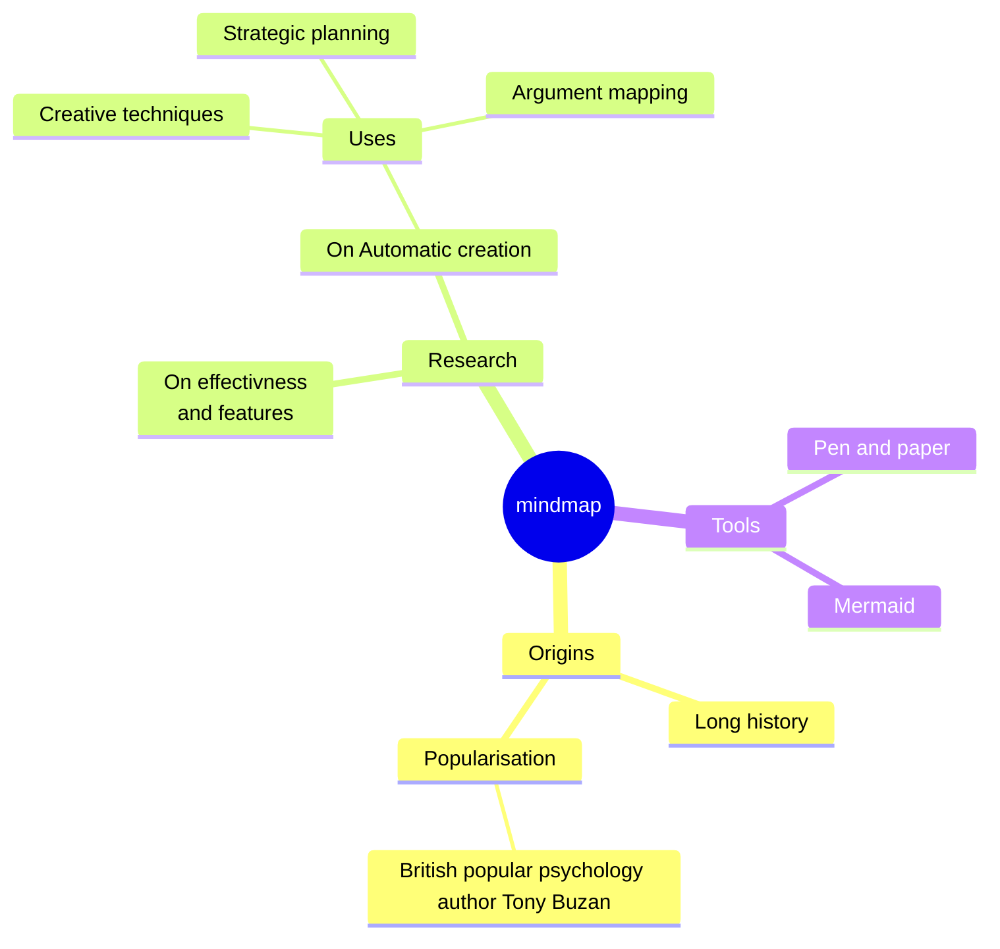
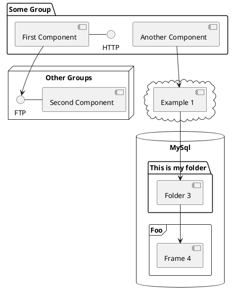

---
# try also 'default' to start simple
theme: seriph
# random image from a curated Unsplash collection by Anthony
# like them? see https://unsplash.com/collections/94734566/slidev
background: https://source.unsplash.com/collection/94734566/1920x1080
# apply any windi css classes to the current slide
class: 'text-center'
# https://sli.dev/custom/highlighters.html
highlighter: shiki
# show line numbers in code blocks
lineNumbers: false
# some information about the slides, markdown enabled
info: |
  ## Slidev Starter Template
  Presentation slides for developers.

  Learn more at [Sli.dev](https://sli.dev)
# persist drawings in exports and build
drawings:
  persist: false
# page transition
transition: slide-up
# use UnoCSS
css: unocss
---

# Lunch n' Learn

Life in software


<!--
The last comment block of each slide will be treated as slide notes. It will be visible and editable in Presenter Mode along with the slide. [Read more in the docs](https://sli.dev/guide/syntax.html#notes)
-->

---
transition: fade-out
layout: two-cols
preload: false
---
<span v-motion :initial="{opacity: 0, scale: .2}" :enter="{opacity: 1, scale: 1, transition: { type: 'keyframes', duration: 1200, ease: 'easeIn'}}">

# Who am I?
little bit more about me

</span>

<v-click>

- My name is Gavin Meier 👋🏻

</v-click>

<v-click>

- Currently work at Sonos 🔊

</v-click>

<v-click>

- Started learning how to program in 2016 🧑🏻‍💻

</v-click>

<v-click>

- Graduated in 2018 🧑🏻‍🎓

</v-click>

<v-click>

- Live in St. Louis County 🏠

</v-click>

<v-click>

- Getting married in September 💍

</v-click>


<v-click>

- I have a dog named Finn 🐩

</v-click>

::right::

<div v-motion :initial="{opacity: 0, scale: .2}" :enter="{opacity: 1, scale: 1, transition: { type: 'keyframes', duration: 700, ease: 'easeIn'}}" class='flex items-center h-full'>
  <Intro />
</div>

<!--
You can have `style` tag in markdown to override the style for the current page.
Learn more: https://sli.dev/guide/syntax#embedded-styles


talking points
from usmsl to software dev
using focus to reach your goals
interviewing in big tech
life for me
whats next


had to leave but joined tdk
  what it was like
  things I liked 
  things I didn't like

graduated and left tdk to join perficient
  capstone
  tada

team at tda
  time spent at tda in the begining
  time working on start ups on the side

time spent working at launch code
  leaving launch code

downfall of tda

mistakes to learn from

nft project

time spent interviewing (a lot)
  getting told no

starting at sonos
  getting promoted at sonos
  where next


hot takes
micro services
complexity
multi language

-->

<style>
h1 {
  background-color: #2B90B6;
  background-image: linear-gradient(45deg, #4EC5D4 10%, #146b8c 20%);
  background-size: 100%;
  -webkit-background-clip: text;
  -moz-background-clip: text;
  -webkit-text-fill-color: transparent;
  -moz-text-fill-color: transparent;
}
</style>

<!--
Here is another comment.
-->

---
layout: default
transition: slide-right
preload: false
---

<div v-motion :initial="{ scale: .2}" :enter="{scale: 1, transition: {type: 'keyframes', ease: 'easeOut', duration: 500 }}">

# Time spent at UMSL
What was life like as a student through the years

</div>

<v-click>

- Started as an accounting major, didn't like class though

</v-click>
<v-click>

- Got a mentor, he recommended:
  - I drop accounting for IS and IB
  - Sign up for the clubs for each

</v-click>

<v-click>

- Started attending events for:
  - IS Programming Club
  - IB Honor Society

</v-click>


<v-click>

- Realized I wanted to write code, not manage people

</v-click>

<v-click>

- Co-op Monsanto (6 months)

</v-click>

<v-click>

- Full time gig at TDK (left after 6 months)

</v-click>

<v-click>

- Graduated December 2018

</v-click>

<div class="w-full flex justify-end items-start -mt-42">

<div v-motion :initial="{y: 200, scale: 2}" :enter="{y: 0, scale: 1, transition: {type: 'spring', stiffness: 20, damping: 10, mass: 3 }}" class='w-md'>

<Graduation />

</div>

</div>

---
transition: slide-up
layout: center
level: 2
preload: false
---

<div class="text-center" v-motion :initial="{y: -100, scale: 2, opacity: .3}" :enter="{y: 0, scale: 1, opacity: 1, transition: {type: 'keyframes', duration: 1000, ease: 'backInOut'}}">

# How I got my first gig
What it took to get into Monsanto's Co-op and why it was important

</div>

<div class="flex justify-center items-center">

<div v-motion :initial="{opacity: .2, scale: .2}" :enter="{opacity: 1, scale: 1, transition: {type: 'keyframes', duration: 1000, ease: 'backInOut'}}" class="w-md">
  <Vision />
</div>
</div>

---
layout: statement
---

# Set myself up
## for luck


---
layout: quote
---

"The meeting of preparation with opportunity generates the offspring we call luck." - Tony Robbins

<!-- 
Good things happen to those that are prepared for them
Didn't know much at the time
Barely knew anything if I am being honest
I did have interests though and understood some cool stuff
But really it came down to being prepared by knowing about it
And showing up
 -->
 <!-- 
Only one selected for ELD program (which made a huge difference)
You get more training on the job
Got trained in React and Node

 -->

---
layout: two-cols
---

# Why it mattered
Training on the job and beyond

- Was able to work with a group of other new employees
- Everyone else in the group was a fresh college graduate though
- Learned about new tools and how pieces fit together
- Learned how big of an impact watching some videos on the side could have

::right::

<Learning />

---
layout: default
---

# Filling in the gaps
Life after the first taste

- Monsanto ending
- TDK op
- Capstone
- TDK status 
- Leaving TDk
- Joining Perficient

---
preload: false
---

# Animations

Animations are powered by [@vueuse/motion](https://motion.vueuse.org/).

```html
<div
  v-motion
  :initial="{ x: -80 }"
  :enter="{ x: 0 }">
  Slidev
</div>
```

<div class="w-60 relative mt-6">
  <div class="relative w-40 h-40">
    
    
    
  </div>

  <div
    class="text-5xl absolute top-14 left-40 text-[#2B90B6] -z-1"
    v-motion
    :initial="{ x: -80, opacity: 0}"
    :enter="{ x: 0, opacity: 1, transition: { delay: 2000, duration: 1000 } }">
    Slidev
  </div>
</div>

<!-- vue script setup scripts can be directly used in markdown, and will only affects current page -->
<script setup lang="ts">
const final = {
  x: 0,
  y: 0,
  rotate: 0,
  scale: 1,
  transition: {
    type: 'spring',
    damping: 10,
    stiffness: 20,
    mass: 2
  }
}
</script>

<div
  v-motion
  :initial="{ x:35, y: 40, opacity: 0}"
  :enter="{ y: 0, opacity: 1, transition: { delay: 3500 } }">

[Learn More](https://sli.dev/guide/animations.html#motion)

</div>

---

# LaTeX

LaTeX is supported out-of-box powered by [KaTeX](https://katex.org/).

<br>

Inline $\sqrt{3x-1}+(1+x)^2$

Block
$$
\begin{array}{c}

\nabla \times \vec{\mathbf{B}} -\, \frac1c\, \frac{\partial\vec{\mathbf{E}}}{\partial t} &
= \frac{4\pi}{c}\vec{\mathbf{j}}    \nabla \cdot \vec{\mathbf{E}} & = 4 \pi \rho \\

\nabla \times \vec{\mathbf{E}}\, +\, \frac1c\, \frac{\partial\vec{\mathbf{B}}}{\partial t} & = \vec{\mathbf{0}} \\

\nabla \cdot \vec{\mathbf{B}} & = 0

\end{array}
$$

<br>

[Learn more](https://sli.dev/guide/syntax#latex)

---

# Diagrams

You can create diagrams / graphs from textual descriptions, directly in your Markdown.

<div class="grid grid-cols-3 gap-10 pt-4 -mb-6">









</div>

[Learn More](https://sli.dev/guide/syntax.html#diagrams)

---
src: ./pages/multiple-entries.md
hide: false
---

---
layout: center
class: text-center
---

# Learn More

[Documentations](https://sli.dev) · [GitHub](https://github.com/slidevjs/slidev) · [Showcases](https://sli.dev/showcases.html)

---
layout: end
---